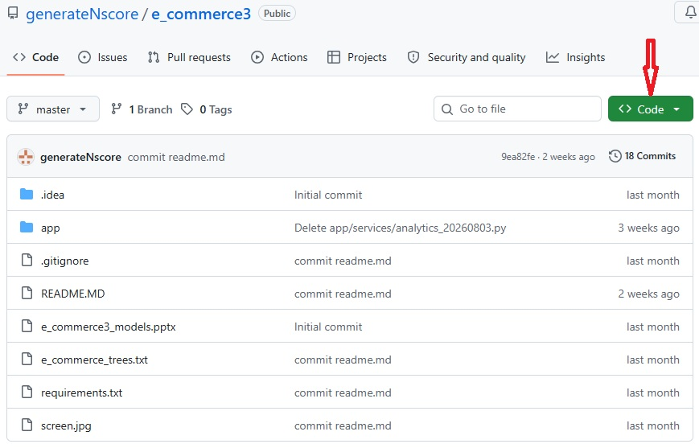
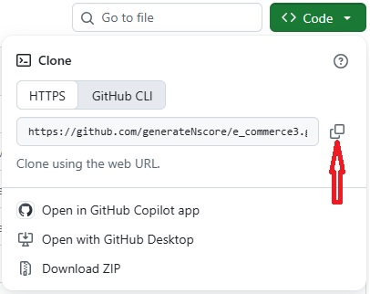
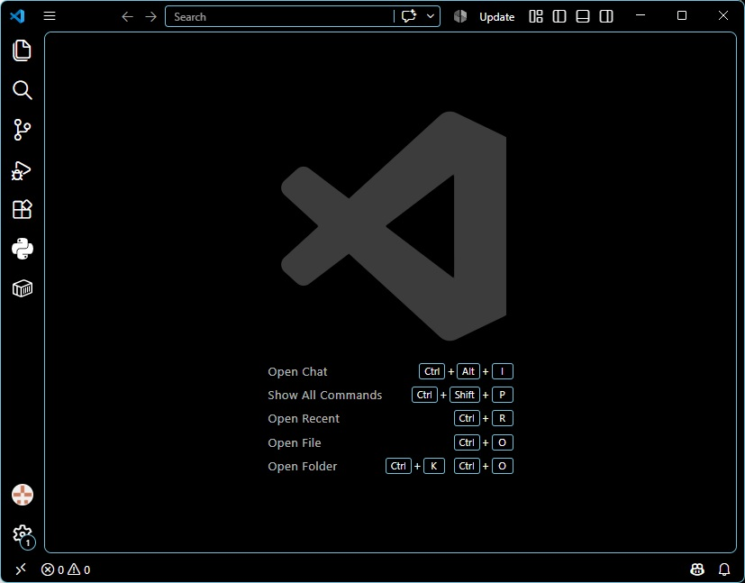

# GitHub repository를 내 컴퓨터 폴더로 내려받기

. 웹브라우저에서 원하는 GitHub의 resository을 찾는다. (아래 글은 https://github.com/generateNscore/e_commerce3을 참조하였으며 windows 사용을 전제로 작성하였다.)

. 아래 화면에 보이는 것처럼 초록색 바탕의 흰색 글씨의 "Code" 버튼을 누르면 나타나는 Repository URL을 복사한다.  

. Visual Studio Code를 연다. 이미 작업 중인 프로젝트가 열려있다면 상단 메뉴에서 File/New Window를 선택하여 아무것도 없는 빈 프로젝트 workspace를 연다. 

. 빈 VScode workspace에서 Ctrl+` (Ctrl + \`` or Cmd + ``)을 눌러 터미널(terminal)을 연다. 참고로 `은 일반적인 따옴표가 아니라, 키보드(windows용) 왼쪽 상단에 위치한 숫자 1 키 왼쪽에 놓여있다 (내 경우) 

. 열린 터미널에 다음 명령어를 입력한다.

```baseh
git clone https://github.com new-folder-name
```

- 위 명령어에서 "https://github.com" 를 앞에서 복사한 repository URL으로 대체하며, "new-folder-name"은 원하는 프로젝트 폴더 이름으로 대체한다. 
- 단순한 폴더명은 위 터미널에 표시된 폴더에 해당 폴더를 생성한다.
- 다른 위치에 폴더를 생성하고 싶으면 절대 폴더명을 적는다.

. 위 명령어를 입력한 후, Enter-키를 누르면 앞서 지정된 폴더 내에 repository에 들어있는 모든 파일들이 내려받아 저장된다.

. 폴더 생성 및 파일들이 모두 제대로 저장되었는 지 확인한다.
