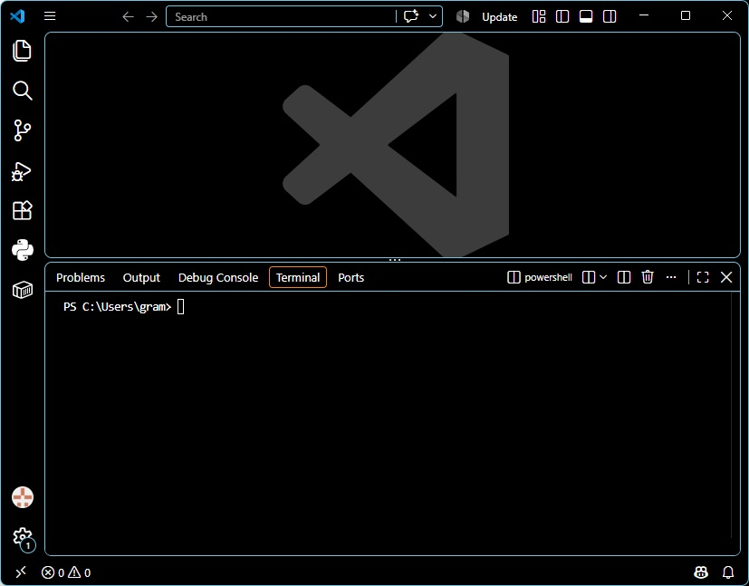
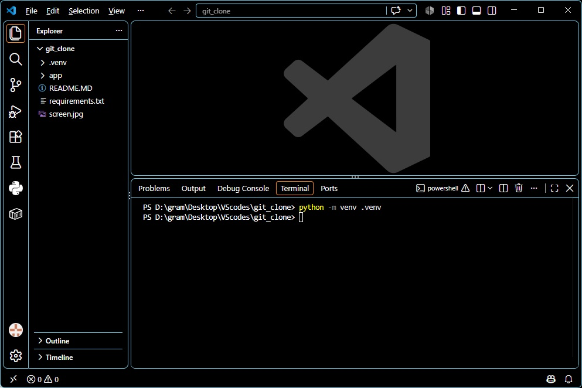
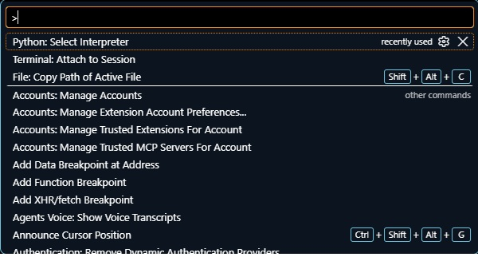
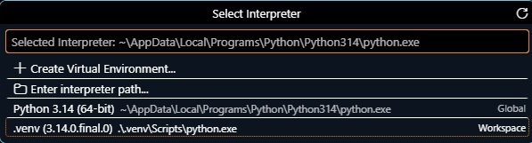
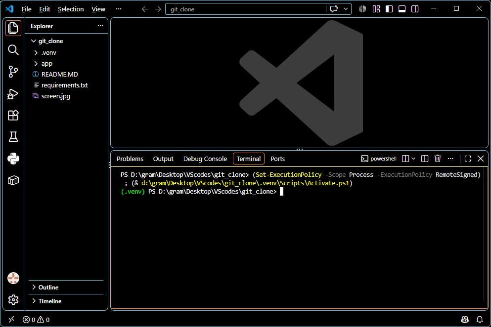

# 새로운 Visual Studio Code 프로젝트 만들기

아래 글은 GitHub의 repository의 clone으로 폴더를 만들었거나, 기존 프로젝트의 폴더의 복사본을 만들어 아직 Visual Studio Code의 프로젝트가 되지 않았다는 사실은 전제로 하며, windows 사용을 전제로 작성하였다.

. Visual Studio Code를 연다. 상단 메뉴에서 File/Open Folder ...를 선택하여 원하는 폴더를 선택한다. (만약 다른 프로젝트를 작업 중이라면, 앞으로 만들어지는 프로젝트가 열리며 기존 프로젝트는 닫힌다.)

. 빈 VScode workspace에서 Ctrl+` (Ctrl + \`` or Cmd + ``)을 눌러 터미널(terminal)을 연다. 참고로 `은 일반적인 따옴표가 아니라, 키보드(windows용) 왼쪽 상단에 위치한 숫자 1 키 왼쪽에 놓여있다 (내 경우) 

. 프로젝트 가상환경 생성: 열린 터미널에 아래 명령어를 입력하고 Enter-키를 눌러 가상 환경을 만든다.
- 만약 해당 폴더 내에 /.venv 이름의 폴더가 있다면 먼저 삭제한다.
- 해당 폴더 내에 /.idea 이름의 폴더는 삭제해도 좋을 듯 (참고: https://www.google.com/search?q=github+.idea+folder&oq=github+.idea+folder+&gs_lcrp=EgZjaHJvbWUyCAgAEEUYHhg5MggIARAAGAgYHjIHCAIQABjvBTIHCAMQABjvBTIHCAQQABjvBTIHCAUQABjvBdIBCTIxMzY2ajBqN6gCALACAA&sourceid=chrome&source=chrome.ob&ie=UTF-8)

```bash
python -m venv .venv
```

- 가상환경 설정이 제대로 되었다면 아래 그림의 왼쪽 Explorer에 .venv 이름의 폴더가 프로젝트 root 폴더 안에 생성되었음을 확인할 수 있다. 
- 만약 위 그림처럼 Explorer가 보이지 않으면, 화면 맨 왼쪽 돋보기 바로 위에 보이는 페이지 모양의 아이콘을 누르면 해당 화면이 나타난다.

. 가상 환경의 python 번역기 선택: VS Code 화면에서 조합-키 Ctrl + Shift + p 를 누른다. 그러면 python interpreter를 선택할 수 있는 화면이 아래 그림과 같이 나타난다. 

. 선택 사항 중 Python: Select Interpretor를 선택하여 아래 그림을 얻는다. 

. 선택 사항 중 맨 밑의 .vnv (3.14.0.final.0) ...을 선택하면 잠시 후 선택 사항들은 모두 없어지고 위의 프로젝트 화면이 다시 나타난다.
- 달라진 것은 아무 것도 없다.

. (중요) 터미널 창 메뉴판의 오른쪽 부분에 쓰레기 아이콘이 보일 것이다. 마우스를 그 위에 올리면 Kill Terminal의 글이 보일 것이다. 쓰레기 아이콘을 눌러 해당 터미널을 없앤다.

. 이제 조합-키 Ctrl + `을 눌러 새로운 터니널을 열고 아래 그림과 같이 초록색 (.venv) 글자가 적힌 prompt를 확인한다. 

. 마지막 단계로 프로젝트 폴더에 파일 requirements.txt을 확인한다. 그리고 터미널에 아래 명령어를 실행하여 GitHub에 올리기 직전 프로젝트와 동일한 환경을 만든다.

```bash
pip install -r requirements.txt
```

